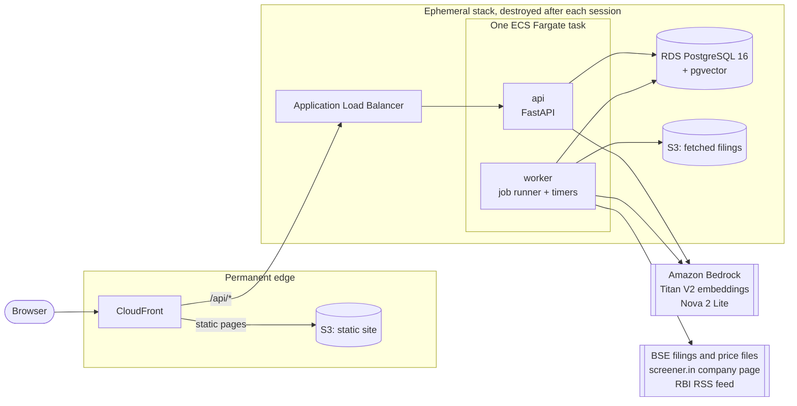
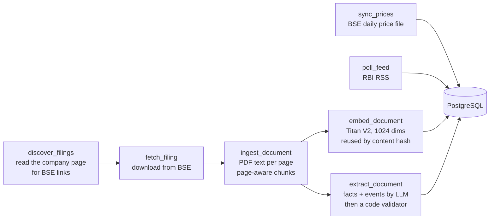
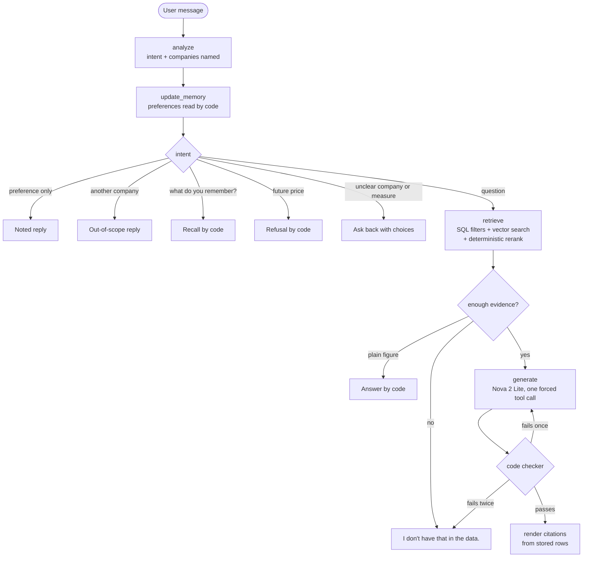

# Contextual Agentic AI Indian Stock Analyst

A personal equity-research assistant for three Indian stocks: **Reliance Industries, TCS and
HDFC Bank**, deployed on AWS. It ingests official exchange filings by itself, extracts provable figures and
events from them, and answers questions in a chat that is **grounded, cited and checked by
code**. Every figure in an answer traces back to a stored filing page, an exchange price file or
a cited table cell, and when the data does not support an answer it says so.

> **Not investment advice.** This is a portfolio and interview project, built to demonstrate a
> real architecture end to end at a deliberately small scale. It is not a financial product.


---

## Contents

- [What it does](#what-it-does)
- [Design principles](#design-principles)
- [Architecture](#architecture)
- [How a chat answer is made](#how-a-chat-answer-is-made)
- [Data sources](#data-sources)
- [Technology](#technology)
- [Repository layout](#repository-layout)
- [Testing and quality gates](#testing-and-quality-gates)
- [Deployment on AWS](#deployment-on-aws)
- [Security](#security)
- [Architecture decision records](#architecture-decision-records)
- [Status and known limitations](#status-and-known-limitations)

---

## What it does

| Area | What the user gets |
|---|---|
| **Sign-in** | Google sign-in (OpenID Connect with PKCE); a server-side session in an HttpOnly cookie. |
| **Stocks** | Follow any of the three stocks. Each stock page shows the share price, a Fundamentals card (market cap, ROE, P/E, EPS, P/B, dividend yield, book value, debt to equity, face value), key facts with their sources, derived values, news sentiment and a dated timeline of recent events. |
| **Documents** | Every filing the app fetched (annual reports, results presentations, earnings-call transcripts, announcements), grouped by kind, with a semantic search across their pages. |
| **News** | Company events extracted from filings, plus Reserve Bank of India press releases from its RSS feed. |
| **Chat** | Questions in plain English: figures, comparisons, trends, causes, valuation, sources. Answers carry clickable citations, and a deterministic checker refuses any answer whose numbers are not in the cited evidence. |
| **Memory** | The app remembers stated investment preferences (risk, debt, style, horizon) from the user's own messages. The user can see, edit and delete each one. |
| **Match** | A rules-based check of each stock against those preferences: *match*, *partial*, *no match* or *not enough data*, every reason showing its figure and source. No LLM involved. |
| **Update data** | One button refreshes filings, prices and the RBI feed. It can be used once an hour, and every page states the date the data is updated to. |

---

## Design principles

1. **The model writes sentences; code owns the facts.** The LLM never writes to the database,
   never produces a URL and never introduces a number. Extracted facts must pass a deterministic
   validator, and chat answers must pass a deterministic citation checker.
2. **Say "I don't have that in the data" rather than guess.** Missing figures are reported as
   missing; one measure is never substituted for another (for example, a bank's net interest
   income is never presented as revenue).
3. **No LLM where code or SQL can do the job.** Plain figure lookups, valuation answers, memory,
   matching, event tagging for the RBI feed and all derived values are deterministic code.
4. **Money is never converted.** Amounts are shown in the currency the filing reports (₹ crore,
   or US$ million where reported), and comparisons combine one currency only.
5. **Derived values are computed on read**, never stored, so they cannot drift from their inputs.
6. **Small scale, real architecture.** Three stocks and one modular monolith, but genuine
   ingestion with idempotency and concurrency safety, vector search, an agent workflow, containers,
   infrastructure as code and CI/CD.

---

## Architecture

A modular monolith on AWS: one Python package, one Docker image run as two containers (`api`
and `worker`) in a single ECS Fargate task, and PostgreSQL on RDS for everything, including the
job queue and the vectors. The frontend is a static export served by CloudFront from S3, so the
browser sees one origin and there is no CORS.



**Ingestion pipeline (worker jobs).** Jobs live in a Postgres table and are claimed with
`FOR UPDATE SKIP LOCKED`. Each claim carries a lease and an attempt number that acts as a fencing
token, and failures retry with exponential backoff. The worker runs lanes side by side: one
web lane for the jobs that reach BSE and screener.in (one request at a time) and two AI lanes for
reading, fingerprinting and the RBI feed.



Idempotency and concurrency safety come from the database: a SHA-256 unique key on every
document, `INSERT ... ON CONFLICT`, and a partial unique index on the job dedupe key, so repeated
or concurrent runs never create duplicates.

---

## How a chat answer is made

The chat is one small, explicit [LangGraph](https://github.com/langchain-ai/langgraph) workflow.
Most routes end in deterministic code; the LLM is called only when a written explanation is
needed, and its output must pass a code checker before anyone sees it.



**Evidence and citations.** Every piece of evidence gets an ID: `N#` document passage, `F#`
fact, `D#` derived value, `E#` event, `M#` match verdict. The model returns claims that cite
those IDs. The checker then verifies that:

- every claim cites at least one existing ID;
- every number in a claim appears in the evidence it cites;
- every amount keeps the currency of its evidence;
- a measure comes from one source per answer, and conflicting figures are refused;
- a stated cause is backed by a filing passage or event, never by sentiment;
- the answer contains no URLs.

The render step resolves IDs to real stored sources, so a link in an answer always points at an
official filing page, a BSE price file or the cited table cell.

**Memory cannot be poisoned.** Preferences come from a fixed vocabulary and are read by code
only from the user's own first-person statements in the current message. They are never read
from retrieved documents, history or model output. A prompt-injection test confirms that a filing
passage written in the first person leaves the profile unchanged.

---

## Data sources

| Source | Used for | How it is accessed |
|---|---|---|
| **BSE filings** (annual reports, presentations, transcripts, announcements; last three years) | Facts, events, search, chat evidence | Links read once a day from each company's screener.in page, PDFs downloaded from BSE's own file addresses |
| **screener.in company page** | Fundamentals table and top ratios, each figure cited to its section, row and column | One page per stock per day, honest User-Agent, allow-listed hosts, nothing behind a login |
| **BSE daily price file ("bhavcopy")** | End-of-day prices, returns, volatility, P/E | A few files per run with long pauses, stopping at the exchange's first rate-limit response |
| **RBI press-release RSS** | Regulatory news; an item becomes a stock event only when it names the company | Conditional GET, every 15 minutes at most |

No other scraping, no live prices and no invented data. Test fixtures use a fictional company
(`DemoCo`, ticker `DEMO`), and synthetic numbers are never associated with the real stocks.

---

## Technology

| Layer | Choice |
|---|---|
| Backend | Python 3.11, FastAPI, Pydantic, SQLAlchemy 2 (async) + asyncpg, Alembic |
| Agent | LangGraph (a fixed workflow; no checkpointer) |
| AI models | Amazon Bedrock with IAM auth: Titan Text Embeddings V2 (1024 dimensions), Amazon Nova 2 Lite |
| Database | PostgreSQL 16 + pgvector: relational data, vectors and the job queue in one store |
| PDF text | pypdfium2 (permissively licensed) |
| Frontend | Next.js 16 static export, React 19, TypeScript; plain CSS with light and dark themes |
| Hosting | AWS ap-south-1 (Mumbai): CloudFront, S3, Application Load Balancer, ECS Fargate, RDS, ECR, IAM, SSM Parameter Store, CloudWatch Logs |
| Infrastructure | Terraform, split into four roots by lifetime; one Docker image for every backend task |
| CI/CD | GitHub Actions with OIDC (no stored AWS keys) |
| Quality | ruff, mypy (strict), pytest; ESLint, tsc, Vitest; Terraform `fmt`, `validate`, `test` |

---

## Repository layout

```
backend/
  src/app/
    api/            HTTP routes under /api/v1 (one error envelope, cursor pagination)
    auth/           Google OIDC, PKCE, sessions
    chat/           LangGraph workflow, evidence, answer checker, renderer, code answers
    memory/         investor-profile vocabulary, extraction by code, storage
    matching/       deterministic matching rules
    prices/         BSE price files, adjustments for bonuses and splits, derived figures
    feeds/          RBI RSS parsing and tagging
    worker.py       job runner and timers (python -m app.worker)
  migrations/       Alembic revisions, one per phase
  tests/            unit, api (in-process ASGI) and integration (real Postgres)
frontend/           Next.js static export: pages, components, Vitest tests
docker/             Postgres init scripts and container tests
infra/
  bootstrap/        Terraform state bucket (applied once)
  edge/             CloudFront + private S3 site (permanent)
  cicd/             ECR, GitHub OIDC provider, CI and deploy roles (permanent)
  stack/            VPC, ALB, ECS (api + worker), RDS, documents bucket, IAM (per session)
  tests/            repository-level checks (hygiene, workflow, deploy script)
scripts/            demo-up / demo-down for the AWS stack
docs/
  mvp.md            acceptance contract
  roadmap.md        phased plan
  runbook.md        AWS operation, timings and failure table
  decisions/        25 architecture decision records
```

---

## Testing and quality gates

| Suite | Scope | Size |
|---|---|---|
| Backend | Unit, API (in-process ASGI) and integration tests against a real PostgreSQL | ~2,800 tests, **100% coverage**, ruff + mypy strict clean |
| Frontend | Components and libraries with Vitest; ESLint, tsc and a real production build | ~700 tests |
| Containers | The backend and frontend images, with deliberate breakages to prove each check bites | ~100 tests |
| Infrastructure | `terraform test` with mock providers for every root, plus repository-level checks | ~250 tests |

Notable tests: concurrent ingestion of the same document, concurrent "Update data" presses,
job leases and fencing, migration up/down/up at every revision, prompt injection against
memory, golden tests for the matching rules, and a guard that every "today" uses India's date.

Development is test-first: each change starts with a failing test.

---

## Deployment on AWS

The deployment is split **by lifetime, not by layer**, into four Terraform roots:

| Root | Contents | Lifetime | Cost |
|---|---|---|---|
| `infra/bootstrap` | Terraform state bucket | Permanent | ~$0 |
| `infra/edge` | CloudFront, private S3 site, origin secret | Permanent | ~$0 (no hourly rate) |
| `infra/cicd` | ECR, GitHub OIDC provider, CI and deploy roles | Permanent | Cents per month |
| `infra/stack` | VPC, ALB, ECS Fargate (api + worker), RDS, documents bucket, IAM | **Created per session, destroyed after** | ~$2.30/day while running |

Keeping the edge permanent keeps the CloudFront domain stable, so the Google OAuth redirect URI
is registered once. No NAT gateway, no autoscaling and no paid monitoring.

**A session.** `scripts/demo-up.ps1` applies `infra/stack`, runs two one-off tasks (create the
no-DDL runtime database role, then migrate the schema), points CloudFront at the new load
balancer, starts the service and waits for `/api/readyz` through CloudFront. Every Terraform apply
waits for a typed `yes`. The database starts empty, and the worker fills it by itself: it fetches
about 85 filings from BSE into the documents bucket, a month of daily prices and the RBI feed,
then fingerprints and reads them through Bedrock (about 20 to 30 minutes, about $0.56).
`scripts/demo-down.ps1` destroys the stack and checks that nothing billable is left.

**What the application may do** is set by Terraform variables, passed to both containers:

| Variable | Default | Controls |
|---|---|---|
| `data_sources_enabled` | `true` | Filings from BSE, daily prices, the live RBI feed |
| `ai_enabled` | `true` | Bedrock: search fingerprints, reading filings, the chat |
| `extraction_budget_usd` | `2` | Spending cap for reading filings |
| `chat_budget_usd` | `1` | Spending cap for the chat |

Both caps are enforced by the application against the spend it records in the database.

**Pipeline** (`.github/workflows/pipeline.yml`, every push to `main`):

1. **Checks:** backend (with a real Postgres), frontend, and Terraform offline plus repository
   checks. None of these jobs has AWS access.
2. **Image:** a push-only role builds the backend image and pushes it to ECR, tagged with the
   commit SHA (immutable tags).
3. **Deploy:** a separate deploy role runs the database migration as a one-off task first, then
   registers new revisions (the new image in every container), updates the service, detects
   rollbacks, checks `/api/readyz` through CloudFront, and finally publishes the frontend. If the
   stack is down, the backend step does nothing.

Both roles trust only this repository's `main` branch through GitHub's immutable OIDC subject,
and every action is pinned by commit SHA. The operating guide, with real timings and a failure
table, is [docs/runbook.md](docs/runbook.md).

---

## Security

- **No secrets in git or in images.** Secrets live in SSM Parameter Store and are injected into
  the containers at start; AWS access everywhere uses IAM roles and OIDC, never access keys.
- **Least privilege.** Two database roles: a migration role with DDL rights, and a runtime role
  with none; the api and worker can read only the runtime URL. Separate IAM roles for CI push,
  deploy, task start-up and the application itself, which may only call the two Bedrock models
  and get or put filings in its own bucket.
- **Network.** The load balancer accepts traffic only from CloudFront and forwards only requests
  carrying a shared secret header; the tasks accept traffic only from the load balancer; RDS sits
  in isolated subnets with no route out. The documents bucket is private, TLS-only and never
  served to users.
- **Invite-only sign-in.** Google confirms who someone is; the app then admits only the emails on
  its allow-list, before anything is stored.
- **Sessions.** Opaque 256-bit tokens, stored only as SHA-256 hashes; `__Host-` cookies that are
  HttpOnly, Secure and SameSite=Lax, plus an Origin check on state-changing requests.
- **Untrusted input.** Retrieved text is treated as data, never as instructions. SQL is always
  parameterised, the XML parser refuses DOCTYPE and ENTITY declarations, and outbound fetches
  only go to allow-listed hosts, redirects included.
- **Errors.** One error envelope; no stack traces, tokens, prompts or document text in responses
  or logs.

---

## Architecture decision records

Every significant choice is documented with its reasoning and trade-offs in
[`docs/decisions/`](docs/decisions/). Highlights:

| ADR | Decision |
|---|---|
| [001](docs/decisions/001-postgresql-pgvector.md) | PostgreSQL + pgvector as the single store |
| [003](docs/decisions/003-langgraph.md) | LangGraph for a small, controlled workflow |
| [005](docs/decisions/005-postgres-job-queue.md) | A Postgres job queue instead of SQS |
| [008](docs/decisions/008-minimal-aws-architecture.md) | One Fargate task with two containers |
| [009](docs/decisions/009-compute-on-read.md) | Derived values computed on read |
| [012](docs/decisions/012-authentication-and-sessions.md) | Google OIDC with PKCE and server-side sessions |
| [015](docs/decisions/015-persistent-edge.md) | Splitting the deployment by lifetime |
| [017](docs/decisions/017-deploy-pipeline.md) | Migrate-first deploy pipeline |
| [020](docs/decisions/020-facts-events-and-derived-values.md) | LLM extraction behind a deterministic validator |
| [021](docs/decisions/021-grounded-chat.md) | Grounded chat with a code checker |
| [022](docs/decisions/022-investor-memory.md) | Investor memory read by code |
| [023](docs/decisions/023-deterministic-matching.md) | Deterministic matching |

---

## Status and known limitations

**Status.** The application, its infrastructure and the pipeline are complete. To keep the cost
near zero, the application stack exists only during a session: it is created with
`demo-up.ps1` and destroyed with `demo-down.ps1`, while the edge, the registry and the pipeline
stay in place. A final hardening phase remains: browser end-to-end tests, rate limiting on
sign-in and a content security policy.

**Known limitations:**

- The citation checker proves that cited IDs exist and that numbers appear in the cited
  evidence. It does not prove full semantic entailment.
- The fact validator proves that the quote, label and number are on the cited page, not that the
  model read the right column or entity. Roughly 1 in 10 accepted filing facts can be wrong in
  that way; disagreeing sources are flagged.
- Prices are end of day only, and BSE keeps about a month of daily files, so price history
  grows one trading day at a time.
- Coverage is limited to three stocks, their filings and the RBI feed.

---

© 2026 Srinivas. All rights reserved.
